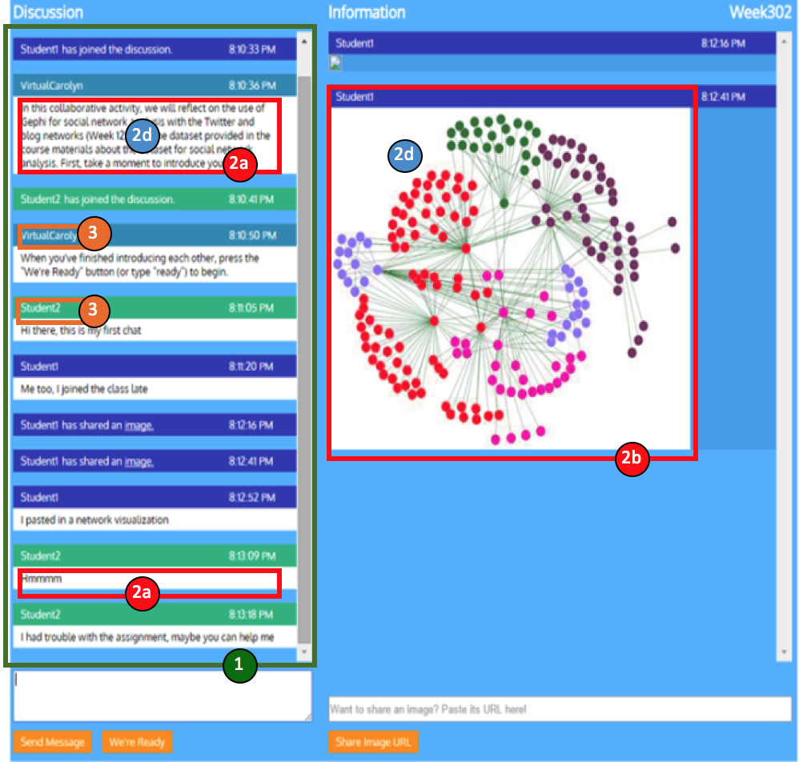
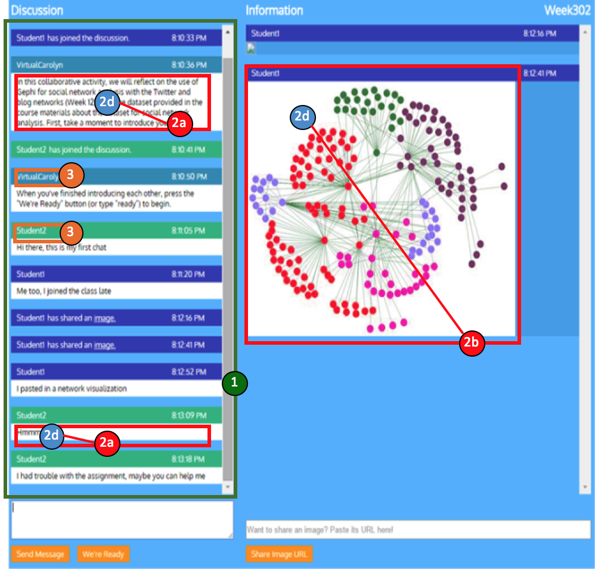
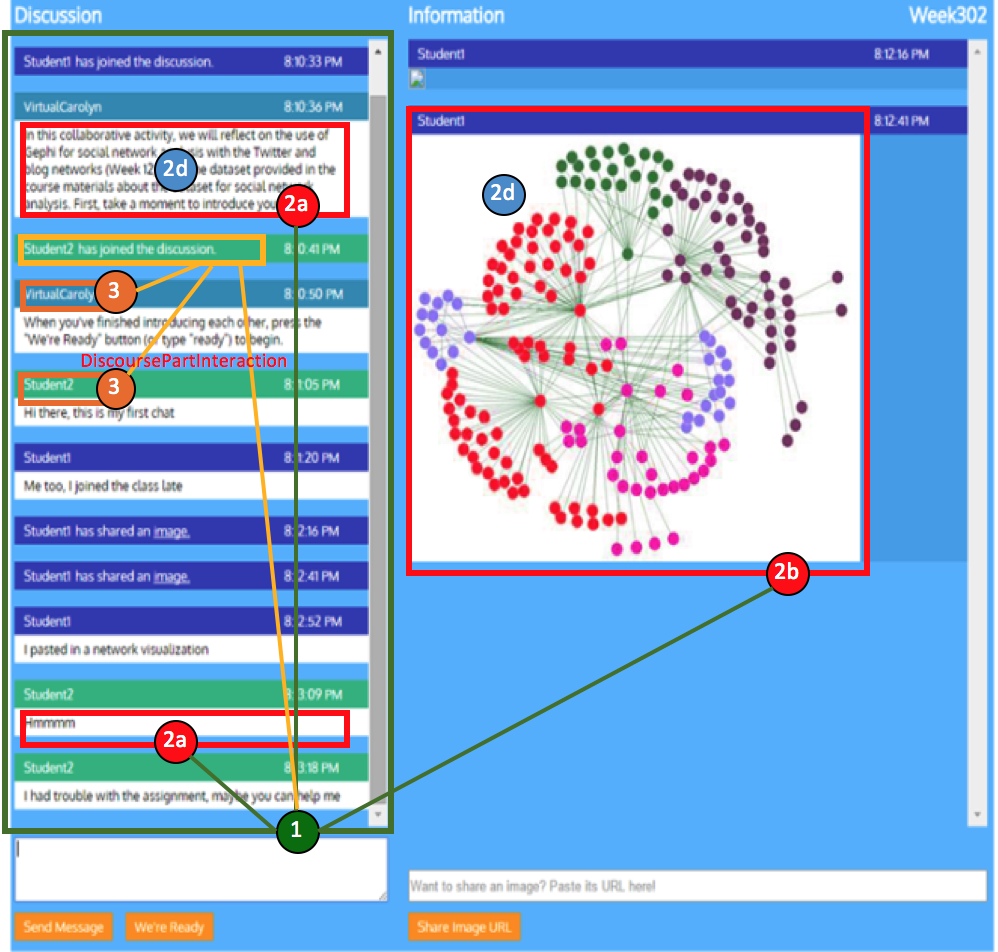

# DiscourseDB converter for Bazaar Chatroom

## Input Data Definition and Launch Parameters
This section defines the input for this converter and the startup parameters.

### Data Source
This converter imports the chatroom data on Bazaar platform into DiscourseDB. The source data are stored in two csv files. One file stores room data. The other one stores all the chat data. Each line in room file stores necessary information (e.g. id, name) of a chatroom. Each line in message file stores necessary information of a message (e.g. id, type, content) in a certain chatroom. The source data are mapped into DiscourseDB line by line with the help of an open source CSV mapper. And during the importing process, a temporary file is created to help build relations.

### Importing Chatroom Data
The import is launched using the class<br/> ```edu.cmu.cs.lti.discoursedb.io.bazaar.converter.BazaarConverterApplication```<br/>

It requires the following startup parameters:<br/>
```BazaarConverterApplication  <DiscourseName> <DataSetName> <RoomFilePath> <MessageFilePath>```<br/>
with <br/>

- **DiscourseName** = the name of discourse that the imported bazaar chatroom data should be associated with
- **DataSetName** = the name for the dataset (e.g. course01) that is imported
- **RoomFilePath** = the location of a csv file that contains data of message information in several chatrooms
- **MessageFilePath** = the location of a csv file that contains data of room information for several chatrooms


## Data Mapping
This section outlines how bazaar chatroom data (including message and room information) from the Bazaar source dataset are mapped to DiscourseDB entities, how the original source artifacts can be identified using DiscourseDB data sources, how the entities relate to each other and what additional entities are generated during the mapping process.


### Visual Overview

<div style=" width: 100%; text-align:center">
 
  </div>
  
<div style=" width: 100%; text-align:center">
<table width="80%" border="0">
  <tr border="0">
    <td align="center"><p>Content Relations</p></td>
    <td align="center"><p>DiscoursePart Relations</p></tr>
  </tr>
</table>
</div>


### Artifact Mappings
| Artifact Number | Source Artifact  | DiscourseDB Entity | DiscourseDB Type |Comments |
| ------------- | ------------- | ------------- | ------------- | ------------- |
| 1 | Chatroom | DiscoursePart | CHATROOM | Room name -> DiscoursePart.name |
| 2a | Text_Message | Contribution | POST | Messages in a chatroom that consist of pure text |
| 2b | Image_Message | Contribution | BAZAAR_IMAGE | Messages in a chatroom that are images |
| 2c | Private_Message | Contribution | PRIVATE_MESSAGE | Private messages in a chatroom |
| 2d | Message_Content | Content | n/a | Content of 2a/2c is text. Content of 2b is image url. |
| 3 | Bazaar_User | User | n/a | User Entities for users who participate in chatting. User name -> User.username |


### Artifact Data Sources
All the Bazaar artifacts extracted have their own ids in the original source files. Therefore, we combine the original id and certain source descriptor as unique identifier for each entity.

Note: Users in source file don't have their unique id. Therefore, we combine the user name and certain source descriptor as unique identifier for each user entity.

| Artifact Number | Source Id | Source Descriptor Enum | Source Descriptor | 
| ------------- | ------------- | ------------- | ------------- |
| 1 |  "room\_id" |BazaarSourceMapping.ID\_STR\_TO\_DISCOURSEPART | "discoursepart#id_str" |
| 2a/2b/2c | "message\_id" |BazaarSourceMapping.ID\_STR\_TO\_CONTRIBUTION | "contribution#id\_str" |
| 2d | "message\_id" | BazaarSourceMapping.ID\_STR\_TO\_CONTENT | "content#id\_str" |
| 3 | "username" | BazaarSourceMapping.FROM_USER_ID_STR_TO_USER | "user#from_user_id_str" |

### Relation Mappings

| DiscourseDB Relation | Relaton Type | Source artifact number |Target artifact number | Comments |
| ------------- | ------------- | ------------- | ------------- |------------- |
|DiscoursePartInteraction|JOIN| 1 | 3 | A user participates in a chatroom. |
|DiscoursePartInteraction|READY| 1 | 3 | A user in a chatroom is ready to chat. |
|DiscoursePartInteraction|UNREADY| 1 | 3 | A user in a chatroom is unready to chat. |
|DiscoursePartInteraction|LEAVE| 1 | 3 | A user leaves a chatroom. |

### Other Generated Entities
The following entity are created during the mapping process, but don't map to an explicit artifact in the data source.

| DiscourseDB Entity | Description |
| ------------- | ------------- |
| Discourse | Manually defined scope. Dataset name and discourse name are assigned at converter startup startup via parameters. |
