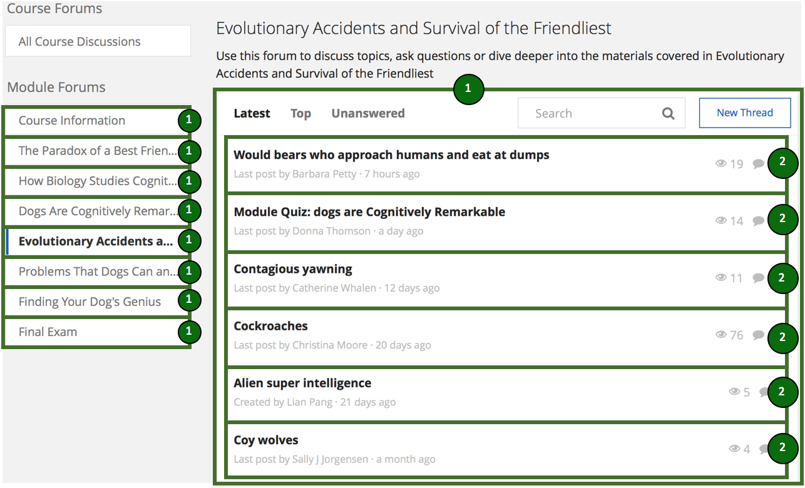
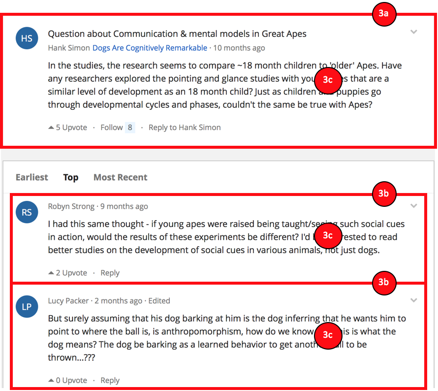
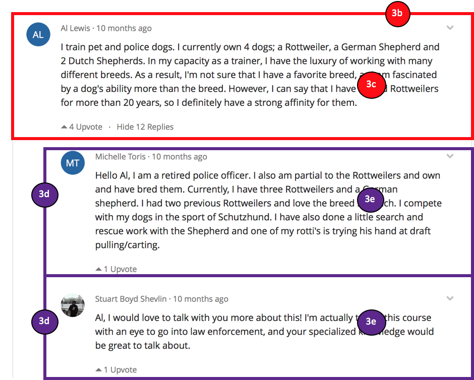
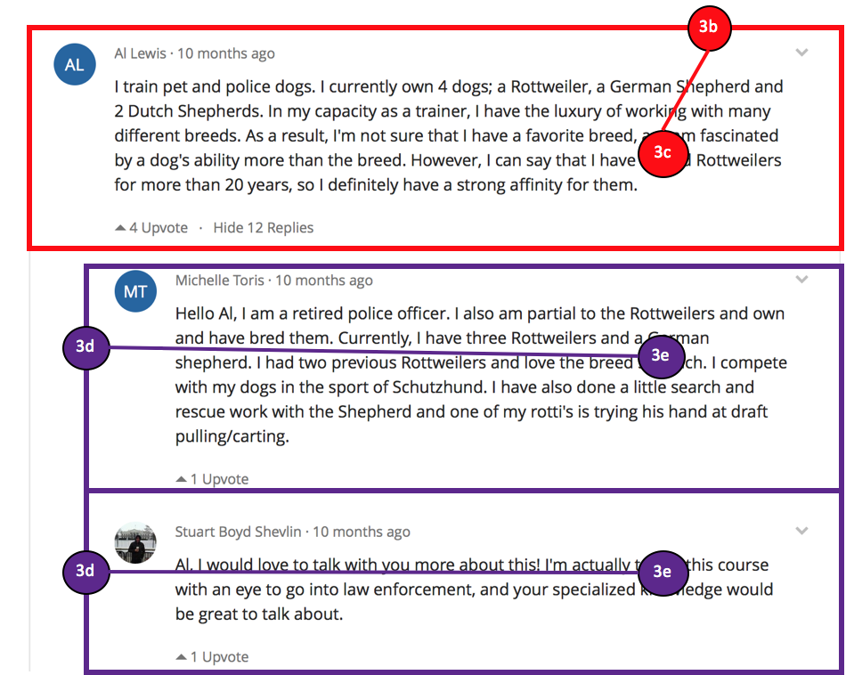
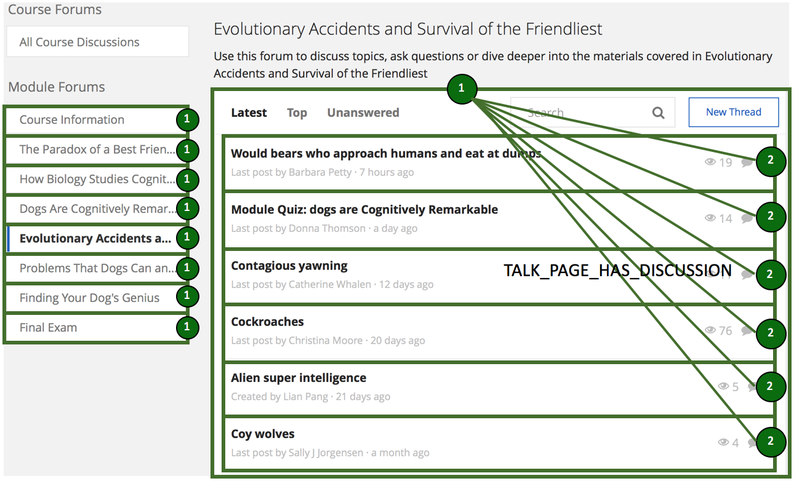
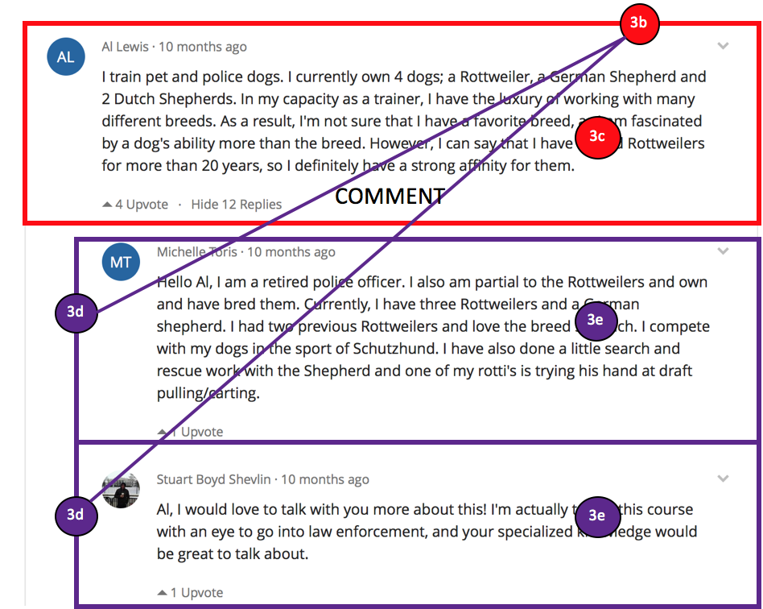

# DiscourseDB converter for Coursera Forum
## Input Data Definition and Launch Parameters
This section defines the input for this converter and the startup parameters.

### Data Source
This converter is used to import the discussion data that are extracted from forums of coursera platform to DiscourseDB. The source data are all stored and organized in a scheme (called coursera) of local database server (e.g. MySQL server). The discussion data that should be imported to DiscourseDB are stored in five tables of coursera schema: \_coursera\_user, forum\_forums, forum\_threads, forum\_posts, forum\_comments. During the importing process, a temporary connection which is based on JDBC will be instantiated and used to read discussion data from coursera schema. All the necessary data realted to discourse will then be mapped and imported to DiscourseDB.  

### Importing Coursera Forum Data
The import is launched using the class<br/> ```edu.cmu.cs.lti.discoursedb.io.coursera.converter.CourseraConverterApplication```<br/>

It requires the following startup parameters:<br/>
```CourseraConverterApplication  <DiscourseName> <DataSetName> <coursera_dbhost> <coursera_db> <coursera_dbuser> <coursera_dbpwd> ```<br/>
with <br/>

- **DiscourseName** = the name of the discourse that the imported coursera forum data should be associated with
- **DataSetName** = a name for the dataset (e.g. the Coursera_Courseraname database) that is imported
- **coursera_dbhost** = host name of the database server (e.g. localhost)
- **coursera_db** = name of the database that stores coursera forum data
- **coursera_dbuser** = username of the database server
- **coursera_dbpwd** = password of the coursera_dbuser on the database server


## Data Mapping
This section outlines how artifacts from the source coursera database are mapped to DiscourseDB entities, how the original source artifacts can be identified using DiscourseDB data sources, how the entities relate to each other and what additional entities are generated during the mapping process.

### Visual Overview

<table width="100%" border="0">
  <tr border="0">
    <td align="center"></td>
    <td align="center"></td>
    <td align="center"></td>
  </tr>
</table>

<table width="100%" border="0">
  <tr border="0">
    <td align="center"><p>Content Relations</p></td>
    <td align="center"><p>Content Relations</p></td>
  </tr>
</table>

<table width="100%" border="0">
  <tr border="0">
    <td align="center"><p>DiscoursePart Relations</p></td>
    <td align="center"><p>DiscoursePart Relations</p></td>
    <td align="center"><p>DiscoursePart Relations</p></td>
  </tr>
</table>


### Artifact Mappings
| Artifact Number | Source Artifact  | DiscourseDB Entity | DiscourseDB Type |Comments |
| ------------- | ------------- | ------------- | ------------- | ------------- |
| 1 | Sub Forum |  DiscoursePart | FORUM | Sub Forum name -> DiscoursePart.name |
| 2  | Thread | DiscoursePart | THREAD | Thread name -> DiscoursePart.name  | 
| 3a | Post | Contribution | THREAD_STARTER | if it is the first post in a thread  |
| 3b | Post | Contribution | POST | other posts except the first one in a thread  |
| 3c | Post_Content | Content | n/a | first and last revision of 3a/b |
| 3d  | Comment | Contribution | Post | replies to a post or comment in a thread |
| 3e  | Comment_Content | Content | n/a | first and last revision of 3e|


### Artifact Data Sources
All impoeted artifacts in coursera forums are entities stored in the source coursera database. Therefore, each artifact has its own id (e.g. forum_id, thread_id and post_id). To distinguish different kinds of artifacts, we combine each artifact's source id and certain source descriptor as its unique identifier in DiscourseDB. As for content entities, we combine the source id of the contribution a content belongs to and certain Content Descriptor as the unique identifier for each Content entity.

| Artifact Number | Source Id | Source Descriptor Enum | Source Descriptor | 
| ------------- | ------------- | ------------- | ------------- |
| 1 | "forum\_id" | CourseraSourceMapping.ID\_STR\_TO\_DISCOURSEPART | "discoursepart#id\_str" | 
| 2 | "thread\_id" | CourseraSourceMapping.ID\_STR\_TO\_DISCOURSEPART\_THREAD | "discoursepart\_thread#id\_str" |
| 3a/3b | "post\_id" | CourseraSourceMapping.ID\_STR\_TO\_CONTRIBUTION | "contribution#id_str" |
| 3c | "post\_id" | CourseraSourceMapping.ID\_STR\_TO\_CONTENT | "content#id\_str" |
| 3d | "comment\_id" | CourseraSourceMapping.ID\_STR\_TO\_CONTRIBUTION\_COMMENT | "contribution\_comment#id\_str" |
| 3e | "comment\_id" | CourseraSourceMapping.ID\_STR\_TO\_CONTENT\_COMMENT | "content\_comment#id\_str" |

### Relation Mappings

| DiscourseDB Relation | Relaton Type | Source artifact number |Target artifact number | Comments |
| ------------- | ------------- | ------------- | ------------- |------------- |
| DiscoursePartRelation | TALK\_PAGE\_HAS\_DISCUSSION | 1 | 2 | DiscourseParts representing threads are part of DiscourseParts representing a sub-forum. |
| DiscourseRelation | DESCENDANT | 3a | 3b | In a thread, all posts are related to their thread starter. |
| DiscourseRelation | COMMENT | 3a/3b | 3d | Comments to certain posts in coursera forums are regared as Comment to source contributions in DiscourseDB. |


### Other Generated Entities
The following entities are created during the mapping process, but don't map to an explicit artifact in the data source.

| DiscourseDB Entity | Description |
| ------------- | ------------- |
| Discourse | Manually defined scope. Dataset name and discourse name are assigned at converter startup startup via parameters. |
| User | User entities are created while creating post and comment contribution entities. The only information of a user is the user id assigned by Coursera forum. And all content entities have a user assigned to them. |
