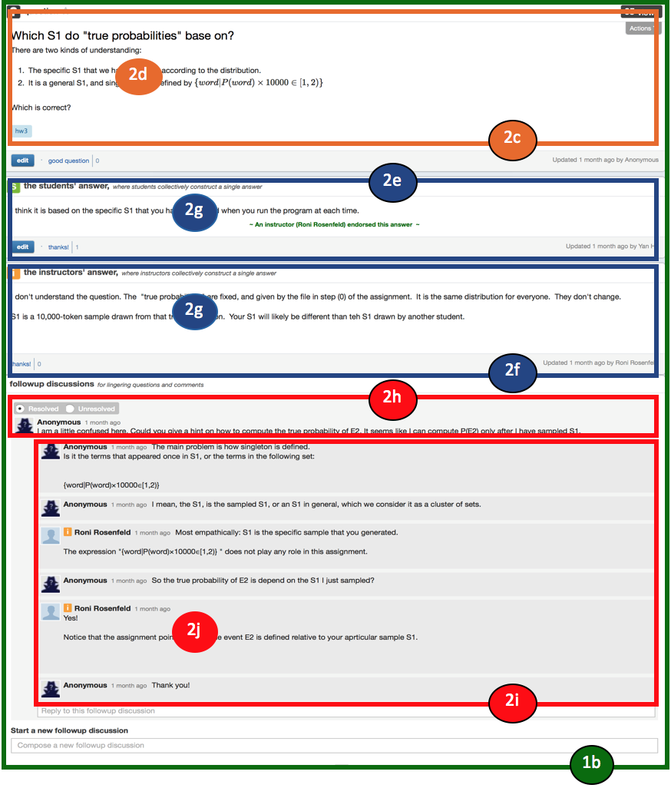
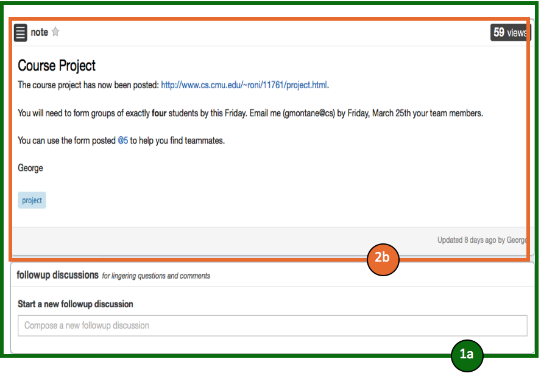
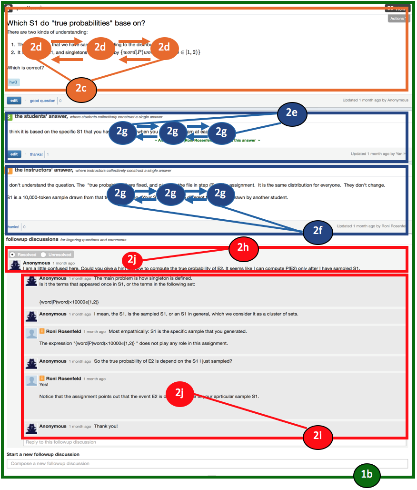
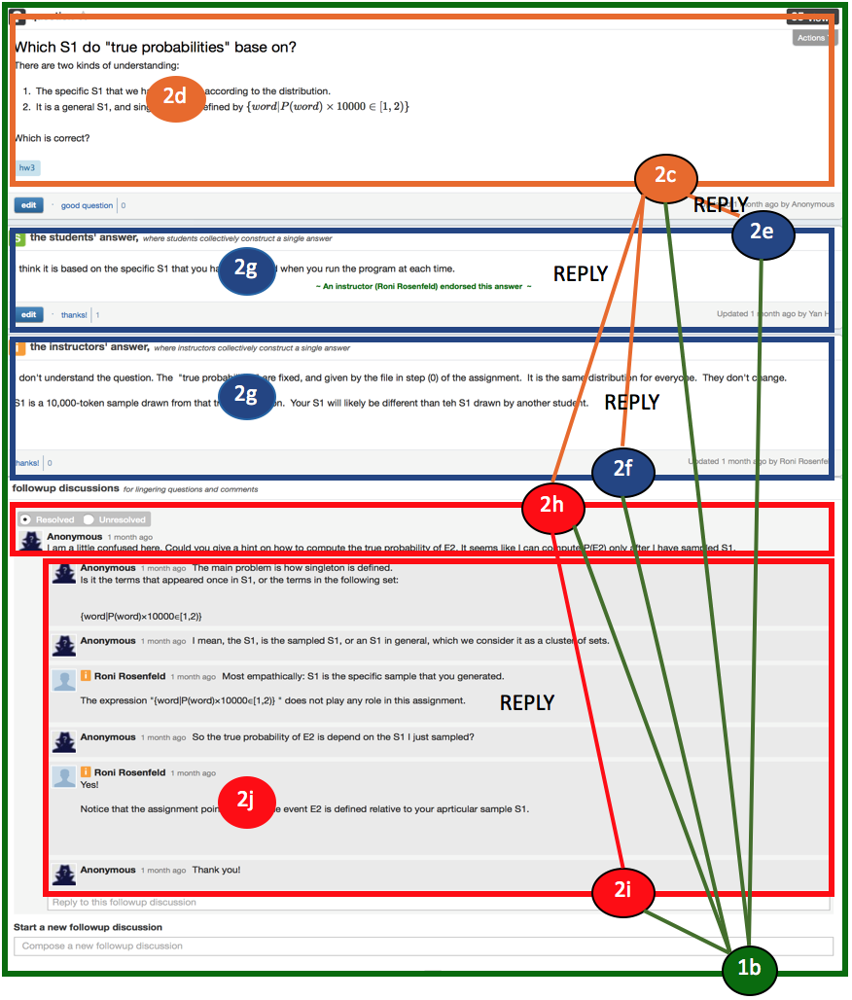

# DiscourseDB converter for Piazza Q&A Part

## Input Data Definition and Launch Parameters
This section defines the input for this converter and the startup parameters.

### Data Source
This converter imports the discussion data in the Q&A part of Piazza platform into DiscourseDB. The source data are several Piazza dump files in JSON format. Each JSON file stores all the discussion data of a certain course in Piazza. 

### Importing Piazza Discussion Data
The import is launched using the class<br/> ```edu.cmu.cs.lti.discoursedb.io.piazza.converter.PiazzaConverterApplication```<br/>

It requires the following startup parameters:<br/>
```PiazzaConverterApplication  <DiscourseName> <DataSetName> <PiazzaDumpPath>```<br/>
with <br/>

- **DiscourseName** = the name of the discourse that the imported piazza discussion data should be associated with
- **DataSetName** = a name for the dataset (e.g. course01) that is imported
- **PiazzaDumpPath** = the location of a JSON dump file that contains data of the posts in Q&A part of a course in Piazza


## Data Mapping
This section outlines how discussion data (including question posts and note posts) from the Piazza source dataset are mapped to DiscourseDB entities, how the original source artifacts can be identified using DiscourseDB data sources, how the entities relate to each other and what additional entities are generated during the mapping process.


### Visual Overview
 
  
<table width="100%" border="0">
  <tr border="0">
    <td align="center"><p>Content Relations</p></td>
    <td align="center"><p>DiscoursePart Relations</p></tr>
  </tr>
</table>

### Artifact Mappings
| Artifact Number | Source Artifact  | DiscourseDB Entity | DiscourseDB Type |Comments |
| ------------- | ------------- | ------------- | ------------- | ------------- |
| 1a  | Note Post |  DiscoursePart | PIAZZA_NOTE | if a piazza post is started with a note, which means that the tag of its JSON unit has value "instructor-note"| 
| 1b  | Question Post | DiscoursePart | PIAZZA_QUESTION | if a piazza post is started with a question, which means that the tag of its JSON unit has value "student"| 
| 2a  | Note | Contribution | THREAD_STARTER | the note part of a note post  |
| 2b  | Note_Content | Content (multiple) | n/a | each note revision is translated to a content entity. 2a points to the oldes and newest of these revisions as firstRevision and currentRevision  |
| 2c  | Question | Contribution | THREAD_STARTER | the question part of a question post  |
| 2d  | Question_Content | Content (multiple) | n/a | each question revision is translated to a content entity. 2c points to the oldes and newest of these revisions as firstRevision and currentRevision  |
| 2e  | Student_Answer | Contribution | PIAZZA_STUDENT_ANSWER | the answer part of a question post. This answer is composed by students |
| 2f  | Instructor_Answer | Contribution | PIAZZA_INSTRUCTOR_ANSWER | the answer part of a question post. This answer is composed by instructors  |
| 2g  | Answer_Content | Content (multiple) | n/a | each student/instructor answer revision is translated to a content entity. 2e/2f points to the oldes and newest of these revisions as firstRevision and currentRevision |
| 2h  | Followup | Contribution | PIAZZA_FOLLOWUP | one of the followups in a post |
| 2i  | Followup_Reply | Contribution | PIAZZA_FOLLOWUP | a reply to one of the followups in a post |
| 2j  | Followup_Content | Content | n/a | first and last revision of 2h/2i |


### Artifact Data Sources
The Piazza artifacts that are mapped to DiscourseDB are extracted by an open source JSON reader. All these artifacts have their own ids in the original source files. Therefore, we combine id and certain source descriptor as unique identifier for each entity.

Note: Since there may be different versions of a question, note or answer, we use multiple Content entities to record all revisions of a question, note or answer. To distinguish different Content revisions of a Contribution, we add version number (e.g. 0, 1, 2) to form the identifier for a Content entity.


| Artifact Number | Source Id | Source Descriptor Enum | Source Descriptor | 
| ------------- | ------------- | ------------- | ------------- |
| 1a  |  "note\_post\_id" |PiazzaSourceMapping.ID\_STR\_TO\_DISCOURSEPART | "discoursepart#id\_str" |
| 1b  |  "question\_post\_id" |PiazzaSourceMapping.ID\_STR\_TO\_DISCOURSEPART | "discoursepart#id\_str" |
| 2a  |  "note\_post\_id" |PiazzaSourceMapping.ID\_STR\_TO\_CONTRIBUTION | "contribution#id\_str" |
| 2b  |  "revision id of content"\_"note\_post\_id" |PiazzaSourceMapping.ID\_STR\_TO\_CONTENT | "content#id\_str" |
| 2c  |  "question\_post\_id" |PiazzaSourceMapping.ID\_STR\_TO\_CONTRIBUTION | "contribution#id\_str" |
| 2d  |  "revision id of content"\_"question\_post\_id" |PiazzaSourceMapping.ID\_STR\_TO\_CONTENT | "content#id\_str" |
| 2e  |  "s\_answer\_child\_id" |PiazzaSourceMapping.ID\_STR\_TO\_CONTRIBUTION | "contribution#id\_str" |
| 2f  |  "i\_answer\_child\_id" |PiazzaSourceMapping.ID\_STR\_TO\_CONTRIBUTION | "contribution#id\_str" |
| 2g  |  "revision id of content"\_"answer\_child\_id" |PiazzaSourceMapping.ID\_STR\_TO\_CONTENT\_ANSWER | "content\_answer#id\_str" |
| 2h  |  "followup\_child\_id" |PiazzaSourceMapping.ID\_STR\_TO\_CONTRIBUTION | "contribution#id\_str" |
| 2i  |  "followup\_child\_id" |PiazzaSourceMapping.ID\_STR\_TO\_CONTRIBUTION | "contribution#id\_str" |
| 2j  |  "revision id of content"\_"followup\_child\_id" |PiazzaSourceMapping.ID\_STR\_TO\_CONTENT | "content#id\_str" |


### Relation Mappings

| DiscourseDB Relation | Relaton Type | Source artifact number |Target artifact number | Comments |
| ------------- | ------------- | ------------- | ------------- |------------- |
|DiscourseRelation|REPLY| 2h | 2i | All followup replies are related to the source replies.|
|DiscourseRelation|REPLY| 2a/2c | 2e/2f/2h | All answers and followps are regared as replies to the question/note contributions in the question/note posts|

### Other Generated Entities
The following entities are created during the mapping process, but don't map to an explicit artifact in the data source.

| DiscourseDB Entity | Description |
| ------------- | ------------- |
| Discourse | Manually defined scope. Dataset name and discourse name are assigned at converter startup startup via parameters. |
| User | User entities are created while creating note, question, answer and followup contribution entities. The only information of a user is the user id assigned by Piazza (If a user is set as anonymous, the user entity will be assigned an uniform id "Anonymous"). And all content entities have a user entity assigned to them. |
