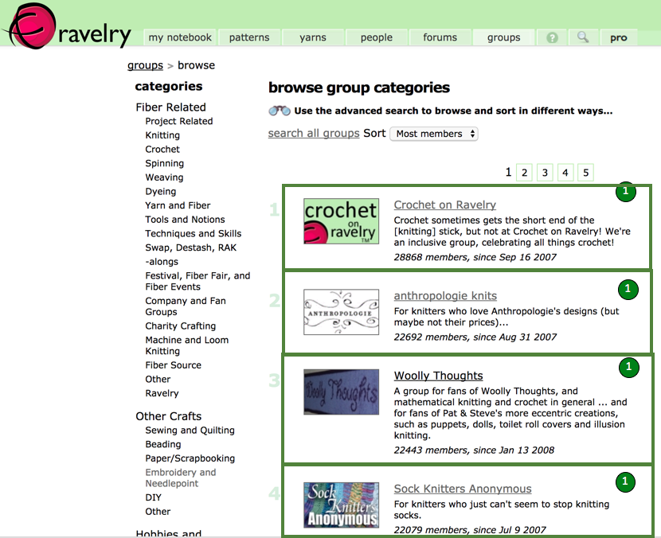
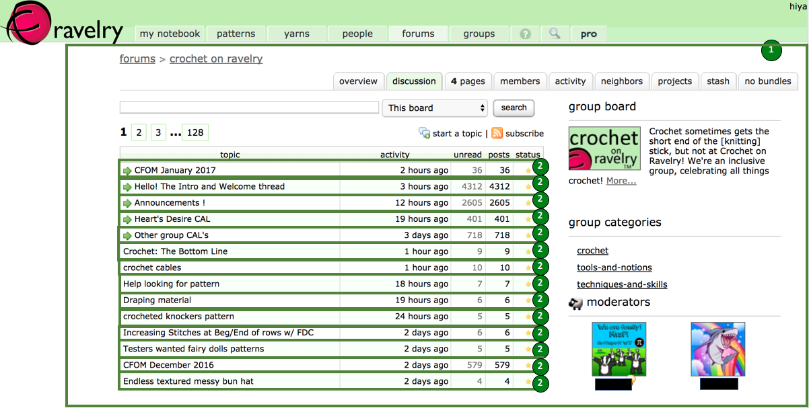
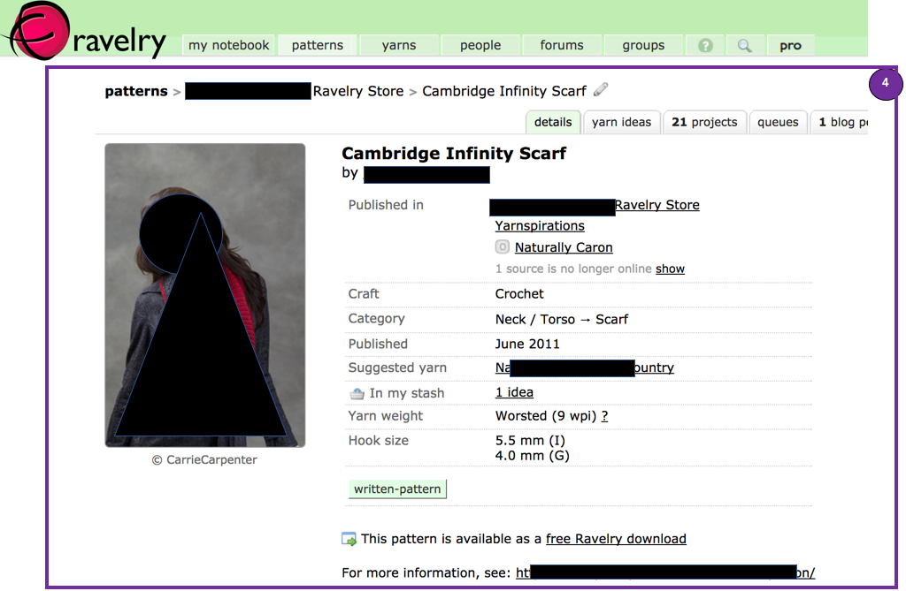

## Ravelry Data Importer

Run RavelryConverterApplication with four command-line arguments:
 * A discourse name (e.g. Ravelry)
 * IP:Port address of a Mongo server containing a scrape of Ravelry API data
 * Database name within Mongo (this will be the Dataset name)
 * Group name to import

Example arguments: Ravelry 127.0.0.1:27017 ravelry-db beginners-knit-along-2

The `custom.properties` file should have the DiscourseDB database information to write to (host, database name, username, and password).

### How Ravelry data is mapped to the DiscourseDB schema

In Ravelry every group has a forum (although there are six additional forums
without a group). A group has a canonical ascii-without-spaces name distinct from the
name that users see, that the Ravelry API calls its "permalink"; we use this internally to identify groups.  For example the group "Beginner's Knit-along" has the permalink "beginners-knit-along-2" Each forum is a list of topics (aka threads) containing multiple
postings.  

Ravelry groups and threads are treated as nested DiscourseParts; Postings are Contributions (with associated Content node), and Patterns are also Content nodes connected to their mention by a Contribution_has_context relation.

Groups are annotated with a textual description and the Ravelry API's numeric ID of the forum they contain.

### Data Sources

| Ravelry Entity | Source ID | Source ID descriptor | Mark in screenshot |
| --- | --- | --- |
| Group/Forum    | `groups#<permalink>`       | ravelry#groups  |   (1) |    
| Topic     | `topics#<numeric topic id>`    |   ravelry#topics| (2) |
| Patterns  |  `pattern#<pattern permalink>` |     ravelry#pattern | (4)  |      
| Postings  | `postings#<post numeric id>`  |    ravelry#postings | (3) |
| Users     |  `people#<username>`           |   ravelry#people | (not shown) |

### Discourse Parts:
| Source ID | Source ID descriptor | DataSourceType | DiscoursePartType |
| --- | --- | --- | --- |
| groups#<permalink>    |   ravelry#groups     |    RAVELRY |  FORUM  |
| topics#<topic_id (numeric)    |   ravelry#topics   |   RAVELRY   |   THREAD |

### Contributions:
| Source ID | Source ID descriptor | DataSourceType | ContributionType |
| --- | --- | --- | --- |
| raverly#postings   |  postings#<post numeric id>  | RAVELRY      |     POST |

### Content
| Source ID | Source ID descriptor | DataSourceType | ContentType |
| --- | --- | --- | --- |
| `pattern#<pattern permalink>` |     ravelry#pattern | RAVELRY | MENTION_OF_PATTERN |
| `pattern#<pattern permalink>` |     ravelry#pattern | RAVELRY | MENTION_OF_PROJECT |
| `postings#<post numeric id>`  |    ravelry#postings | RAVELRY | POST |

### Relations
| From Table | From Type | To Table | To Type | Relation Table | Relation Type | Explanation |
| --- | --- | --- | --- | --- | --- | --- |
| DiscoursePart | FORUM | DiscoursePart | THREAD | DiscoursePartRelation | SUBPART | Topics are part of forums |
| DiscoursePart | THREAD | CONTRIBUTION | POST | ContributionPartOfDiscoursePart | (N/A) | Postings are in Topics |
| Contribution | POST | CONTENT | (N/A) | ContribuionContext | MENTION_OF_PATTERN | When someone gives the URL to a pattern in a post |
| Contribution | POST | CONTENT | (N/A) | ContribuionContext | MENTION_OF_PROJECT | When someone gives the URL to a project in a post |

### Annotations

There is an annotation of type "group_metadata" with two attributes: "description" and "forum_id", which
is attached to FORUM-type DiscourseParts, and contains the group's textual description, and a numeric ID of its
associated forum.

### Screenshots:

